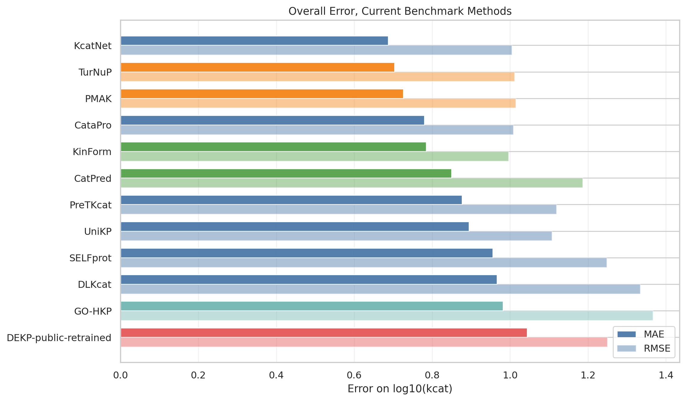
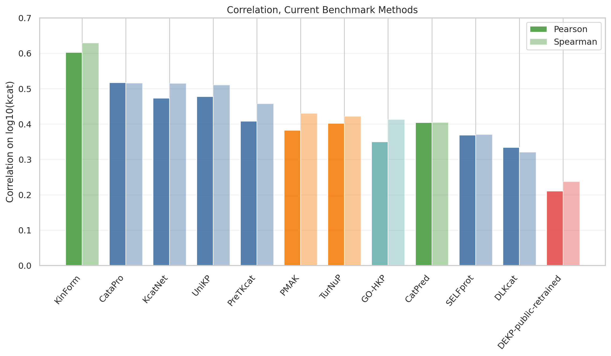
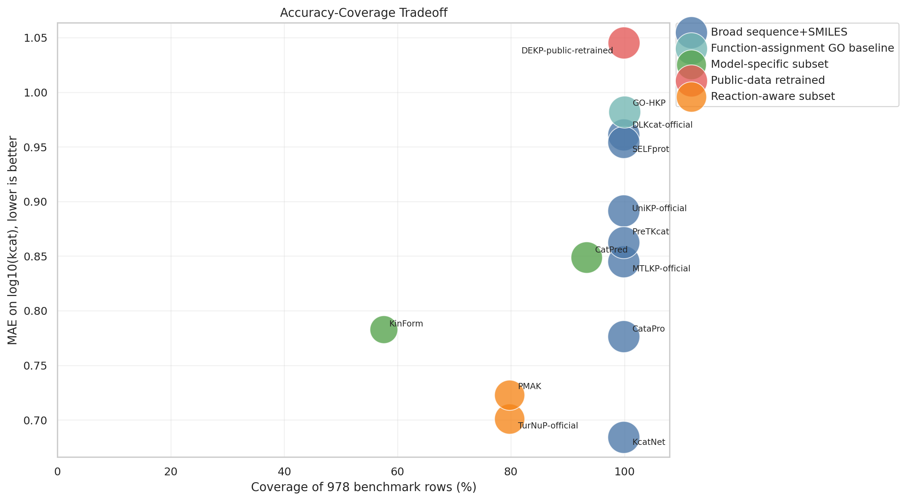
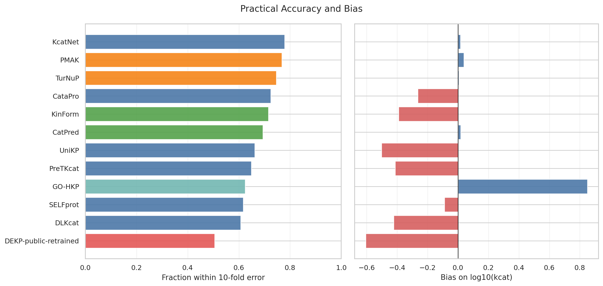
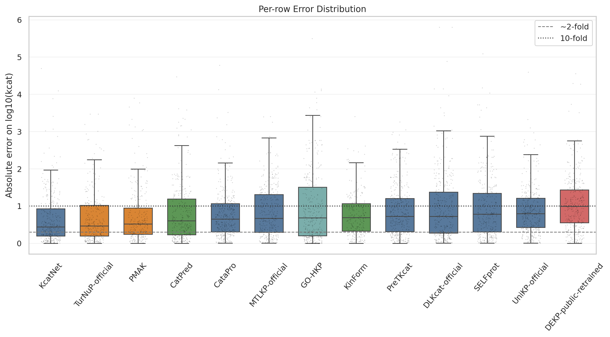
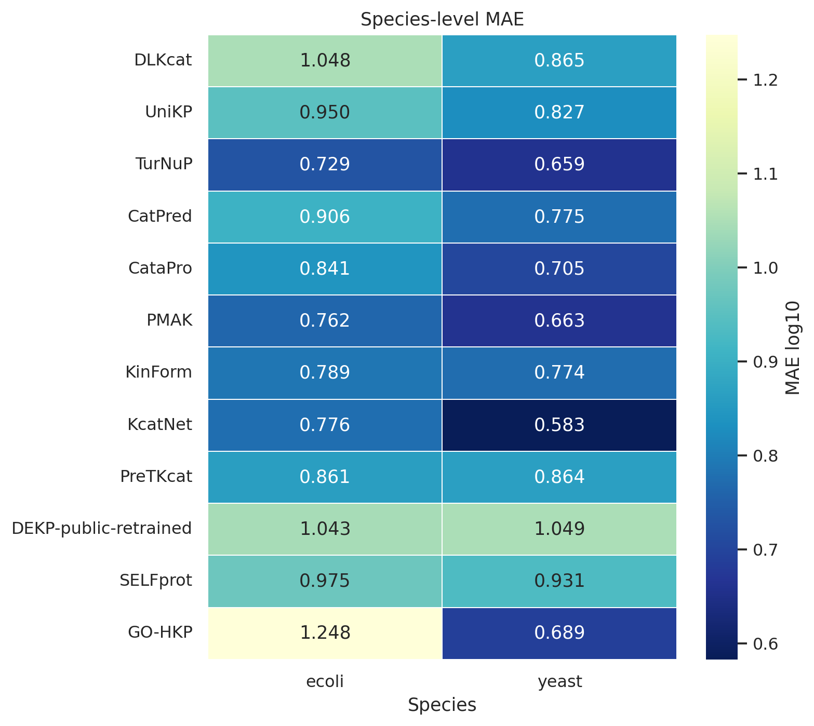
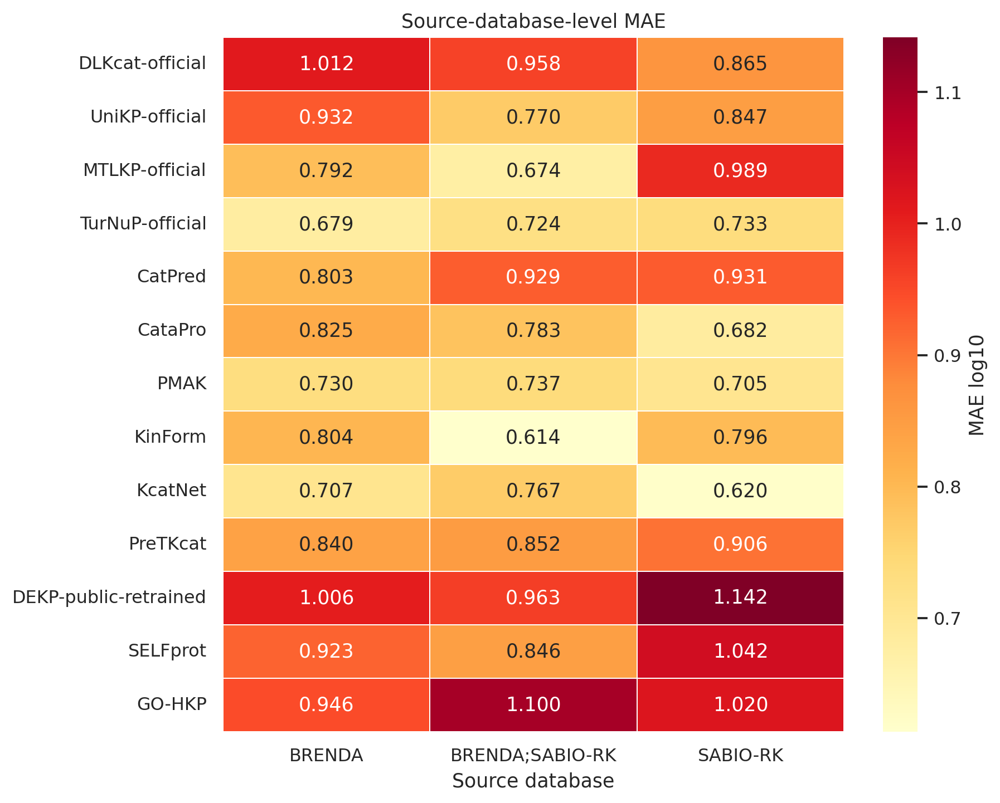
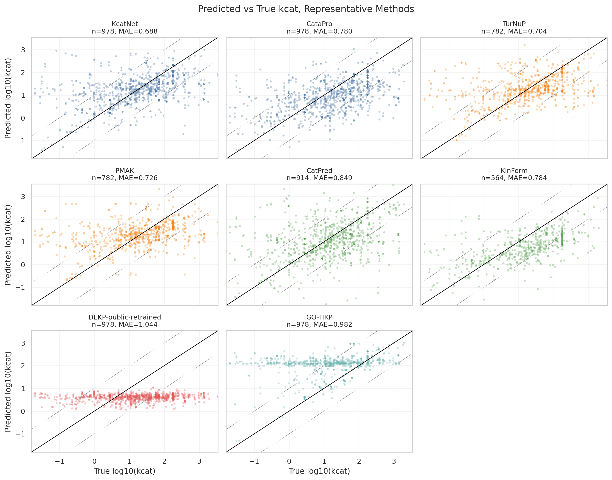

# kcat 预测方法统一评测分析报告

生成日期：2026-06-30

## 一句话结论

在当前 978 条 *E. coli* + yeast enzyme-substrate 实验 kcat benchmark 上，若按当前可比的正式评测结果看，`KcatNet` 是“全量/近全量 sequence+SMILES”方法中误差最低的方法，MAE log10 为 0.6841，覆盖 977 条；`KcatNet` 在所有当前方法中 MAE 最低，MAE log10 为 0.6841，它所属分组为“全量/近全量 sequence+SMILES”；`KinForm` 的 Spearman 相关性最高，为 0.6297。

这里的 MAE log10 可以通俗理解为“预测值和实验值差了几个 10 倍单位”。例如误差 1.0 表示大约差 10 倍，误差 0.3 表示大约差 2 倍。

GO-HKP 是“功能相似性直接赋值”非 AI 基线：当前覆盖 978/978 条记录，E. coli 使用本地 GO-HKP DeepGO-SE 反应级赋值，yeast 使用 UniProt GO 注释做 GOATOOLS-style 补充赋值。整体 MAE log10 为 0.9820，Spearman 为 0.4130，10 倍误差内比例为 0.6247，bias 为 0.8497。这说明 GO 功能赋值可以作为有解释性的非 AI 基线，但整体仍没有优于最强的 AI 预测方法，并且仍有偏高估趋势。

## 评测口径

- 真值集合：`data/final/benchmark_ready_catpred.csv`，共 978 条实验 kcat 记录。
- 统一指标：MAE、RMSE、Pearson、Spearman、bias，以及误差在 10 倍以内的比例，全部在 log10(kcat) 尺度上计算。
- 当前正式评测方法：`DLKcat-official`、`UniKP-official`、`MTLKP-official`、`TurNuP-official`、`CatPred`、`CataPro`、`PMAK`、`KinForm`、`KcatNet`、`PreTKcat`、`DEKP-public-retrained`、`SELFprot`、`GO-HKP`。
- 其中 `GO-HKP` 是功能相似性直接赋值基线，不是 AI 回归模型；它用 GO 层级把功能相近的酶/反应归到可参考的 kcat 统计值上，用来回答“直接赋值是否已经足够强”这个问题。本项目中 E. coli 用 GO-HKP 已有 DeepGO-SE 结果，yeast 用 UniProt GO 注释补齐。

## 分组定义与方法归属

这些分组不是按模型名字主观划分，而是按“输入信息是否一致、覆盖范围是否一致、权重来源是否一致、是否为 AI 回归模型”来划分。通俗说，只有输入口径和覆盖范围接近的方法，才适合直接横向排名。

| 分组                        | 判定标准                                                                                                                                  | 方法                                                                                  |
|:----------------------------|:------------------------------------------------------------------------------------------------------------------------------------------|:--------------------------------------------------------------------------------------|
| 全量/近全量 sequence+SMILES | 输入主要是酶序列和单底物 SMILES，除 1 条非法 SMILES 外基本能覆盖 978 条 benchmark。                                                       | DLKcat-official, UniKP-official, MTLKP-official, CataPro, KcatNet, PreTKcat, SELFprot |
| reaction-aware 子集         | 模型需要完整反应信息，即底物侧、产物侧和酶序列；当前只有 780 条补齐了 reaction SMILES。                                                   | TurNuP-official, PMAK                                                                 |
| 模型特定子集                | 方法官方推理流程或输入限制导致只能在该模型可处理子集上评估。                                                                              | CatPred, KinForm                                                                      |
| 公开数据重训版              | 不是原论文官方最优权重，而是用公开数据和当前可复现流程重新训练/补齐后的版本。                                                             | DEKP-public-retrained                                                                 |
| 功能相似性 GO 赋值基线      | 不训练深度回归模型，而是用 GO 功能层级和已有 GO-kcat 统计值给反应/基因直接赋 kcat；当前 E. coli 和 yeast 的 GO 来源不同，需在正文中标注。 | GO-HKP                                                                                |

每个方法的详细标注如下：

| method                | group_cn                    | modality                                |   n | coverage_percent   | coverage_note                                                                                              |
|:----------------------|:----------------------------|:----------------------------------------|----:|:-------------------|:-----------------------------------------------------------------------------------------------------------|
| DLKcat-official       | 全量/近全量 sequence+SMILES | sequence + substrate SMILES             | 977 | 99.9%              | 覆盖 977/978，缺 1 条非法 SMILES。                                                                         |
| UniKP-official        | 全量/近全量 sequence+SMILES | sequence + substrate SMILES             | 977 | 99.9%              | 覆盖 977/978，缺 1 条非法 SMILES。                                                                         |
| MTLKP-official        | 全量/近全量 sequence+SMILES | sequence + substrate SMILES             | 977 | 99.9%              | 覆盖 977/978，缺 1 条非法 SMILES。                                                                         |
| TurNuP-official       | reaction-aware 子集         | reaction + enzyme                       | 780 | 79.8%              | 覆盖 780/978；缺失来自未补齐完整 reaction SMILES 的记录。                                                  |
| CatPred               | 模型特定子集                | sequence + substrate SMILES             | 913 | 93.4%              | 覆盖 913/978；缺失来自 CatPred 官方流程可处理范围。                                                        |
| CataPro               | 全量/近全量 sequence+SMILES | sequence + substrate SMILES             | 977 | 99.9%              | 覆盖 977/978，缺 1 条非法 SMILES。                                                                         |
| PMAK                  | reaction-aware 子集         | reaction + enzyme                       | 780 | 79.8%              | 覆盖 780/978；缺失来自未补齐完整 reaction SMILES 的记录。                                                  |
| KinForm               | 模型特定子集                | sequence + substrate SMILES             | 563 | 57.6%              | 覆盖 563/978；主要受 KinForm 可处理输入范围限制。                                                          |
| KcatNet               | 全量/近全量 sequence+SMILES | sequence + substrate SMILES             | 977 | 99.9%              | 覆盖 977/978，缺 1 条非法 SMILES。                                                                         |
| PreTKcat              | 全量/近全量 sequence+SMILES | sequence + substrate SMILES             | 977 | 99.9%              | 覆盖 977/978，缺 1 条非法 SMILES。                                                                         |
| DEKP-public-retrained | 公开数据重训版              | sequence + substrate SMILES + structure | 977 | 99.9%              | 覆盖 977/978；缺 1 条非法 SMILES，同时需要结构/图特征补齐。                                                |
| SELFprot              | 全量/近全量 sequence+SMILES | sequence + substrate SMILES             | 977 | 99.9%              | 覆盖 977/978，缺 1 条非法 SMILES。                                                                         |
| GO-HKP                | 功能相似性 GO 赋值基线      | GO hierarchy + functional assignment    | 978 | 100.0%             | 覆盖 978/978；E. coli 为 GO-HKP DeepGO-SE 反应级赋值，yeast 为 UniProt GO 注释的 GOATOOLS-style 补充赋值。 |

## 总体结果

| method                | group_cn                    | modality                                |   n | coverage_percent   |   mae_log10 |   rmse_log10 |   pearson_log10 |   spearman_log10 |   within_1.0_log10_fraction |   bias_log10 |
|:----------------------|:----------------------------|:----------------------------------------|----:|:-------------------|------------:|-------------:|----------------:|-----------------:|----------------------------:|-------------:|
| KcatNet               | 全量/近全量 sequence+SMILES | sequence + substrate SMILES             | 977 | 99.9%              |      0.6841 |       0.9962 |          0.4738 |           0.5149 |                      0.7789 |       0.016  |
| TurNuP-official       | reaction-aware 子集         | reaction + enzyme                       | 780 | 79.8%              |      0.7009 |       1.0061 |          0.4024 |           0.4224 |                      0.7462 |       0.0067 |
| PMAK                  | reaction-aware 子集         | reaction + enzyme                       | 780 | 79.8%              |      0.7227 |       1.0091 |          0.3828 |           0.4303 |                      0.7679 |       0.0386 |
| CataPro               | 全量/近全量 sequence+SMILES | sequence + substrate SMILES             | 977 | 99.9%              |      0.7763 |       0.9977 |          0.5177 |           0.5158 |                      0.7247 |      -0.2644 |
| KinForm               | 模型特定子集                | sequence + substrate SMILES             | 563 | 57.6%              |      0.7827 |       0.9894 |          0.6028 |           0.6297 |                      0.7158 |      -0.3905 |
| MTLKP-official        | 全量/近全量 sequence+SMILES | sequence + substrate SMILES             | 977 | 99.9%              |      0.8449 |       1.0941 |          0.4628 |           0.3946 |                      0.6418 |      -0.3893 |
| CatPred               | 模型特定子集                | sequence + substrate SMILES             | 913 | 93.4%              |      0.8487 |       1.1854 |          0.4051 |           0.4044 |                      0.6933 |       0.0175 |
| PreTKcat              | 全量/近全量 sequence+SMILES | sequence + substrate SMILES             | 977 | 99.9%              |      0.8623 |       1.1105 |          0.4087 |           0.4581 |                      0.6489 |      -0.4124 |
| UniKP-official        | 全量/近全量 sequence+SMILES | sequence + substrate SMILES             | 977 | 99.9%              |      0.8914 |       1.0995 |          0.478  |           0.5106 |                      0.6622 |      -0.5019 |
| SELFprot              | 全量/近全量 sequence+SMILES | sequence + substrate SMILES             | 977 | 99.9%              |      0.9541 |       1.2452 |          0.3694 |           0.3706 |                      0.6172 |      -0.0889 |
| DLKcat-official       | 全量/近全量 sequence+SMILES | sequence + substrate SMILES             | 977 | 99.9%              |      0.961  |       1.3208 |          0.3345 |           0.3209 |                      0.607  |      -0.4226 |
| GO-HKP                | 功能相似性 GO 赋值基线      | GO hierarchy + functional assignment    | 978 | 100.0%             |      0.982  |       1.3668 |          0.3499 |           0.413  |                      0.6247 |       0.8497 |
| DEKP-public-retrained | 公开数据重训版              | sequence + substrate SMILES + structure | 977 | 99.9%              |      1.0454 |       1.2458 |          0.2112 |           0.2375 |                      0.5056 |      -0.6058 |

## 图表解读

### 1. 整体误差：MAE/RMSE

MAE 更接近日常理解中的“平均偏差”，RMSE 会对特别大的错误惩罚更重。`KcatNet` 在覆盖 977 条的情况下 MAE 最低；`TurNuP-official` 和 `PMAK` 的 MAE 也低，但它们只覆盖完整 reaction SMILES 的 780 条，因此更适合作为 reaction-aware 子集比较。

### 2. 排序相关性：Pearson/Spearman

Pearson 看线性相关，Spearman 更看排序是否一致。`KinForm` 的 Spearman 最高，说明在它能覆盖的 563 条子集上，预测排序与实验排序较一致；但它不是全量覆盖方法。全量/近全量方法中，`CataPro`、`KcatNet`、`UniKP-official` 的相关性相对靠前。

### 3. 准确率与覆盖率权衡

这张图的右下角最理想：覆盖率高、误差低。颜色对应上面的分组：蓝色是全量/近全量 sequence+SMILES，橙色是 reaction-aware 子集，绿色是模型特定子集，红色是公开数据重训版，青色是 GO 功能赋值基线。`KcatNet` 位于较理想区域；`CataPro` 覆盖完整且表现稳定；`TurNuP-official`、`PMAK` 误差较低但覆盖率受 reaction SMILES 限制；`KinForm` 相关性好但覆盖条数更少；`GO-HKP` 已覆盖全 benchmark，主要作为非 AI 赋值基线。

### 4. 10 倍误差内比例与系统性偏差

左图是预测落在实验值 10 倍范围内的比例，越高越好；右图是 bias，负值表示整体偏低估，正值表示整体偏高估。`KcatNet` 的 10 倍内比例最高，`PMAK` 和 `TurNuP-official` 也较高。`DLKcat-official`、`UniKP-official`、`MTLKP-official`、`PreTKcat`、`DEKP-public-retrained` 整体有不同程度的低估趋势；`GO-HKP` 则明显偏高估。

### 5. 单条记录误差分布

箱线图展示每个方法在逐条样本上的绝对误差。黑色虚线约等于 2 倍误差，黑色点线是 10 倍误差。`KcatNet` 的中位误差最低；`DEKP-public-retrained` 的中位误差和长尾错误都偏大，说明公开数据重训版还没有达到理想状态。

### 6. 按物种表现

物种分层可以帮助判断模型是否只在某个物种上表现好。总体看，多数方法在 *E. coli* 和 yeast 上有差异；写文章时建议保留 species-level 指标，避免单个 overall 数字掩盖物种偏差。

### 7. 按数据来源表现

BRENDA 和 SABIO-RK 的数据来源、实验条件记录方式不同，分层后能看到模型对不同来源数据的适应性。这个图适合放补充材料，主文可以简述“不同来源之间存在方法表现差异”。

### 8. 预测值 vs 实验值

对角线是理想预测，点线是相差 10 倍的范围。这个图能直观看到哪些方法存在压缩动态范围、整体偏高/偏低或极端错误。`KcatNet` 和 `CataPro` 的点云相对更贴近对角线；`DEKP-public-retrained` 的偏离更明显。

## 推荐写作口径

1. 方法可按输入口径和模型性质分组：全量/近全量 sequence+SMILES、reaction-aware 子集、模型特定子集、公开数据重训版、功能相似性 GO 赋值基线。
2. 如果只强调全量覆盖和误差，`KcatNet` 是当前最强基线；如果强调完整 reaction 信息方法，`TurNuP-official` 和 `PMAK` 应在 780 条 reaction-aware 子集内比较。
3. `KinForm` 的相关性最好但覆盖有限，适合描述为“在可覆盖子集上排序能力强”。
4. `DEKP-public-retrained` 应明确是公开数据重训版，不等价于原论文最优官方模型。
5. `GO-HKP` 应明确是非 AI 直接赋值基线；当前结果说明“按 GO 层级直接赋值”在本 benchmark 上不能替代主流 AI 预测方法，但很适合作为一个朴素生物学基线。还需要说明 E. coli 和 yeast 的 GO 来源不同。

## 文件索引

- 总表：`reports/tables/method_eval_summary.csv`
- 注释版总表：`reports/tables/method_eval_summary_annotated.csv`
- 方法分组注释表：`reports/tables/method_group_annotation.csv`
- 当前方法排序表：`reports/tables/method_rank_current_benchmark.csv`
- 物种 MAE 矩阵：`reports/tables/species_mae_matrix.csv`
- 数据来源 MAE 矩阵：`reports/tables/source_database_mae_matrix.csv`
- 图表目录：`reports/figures/kcat_benchmark_summary/`
